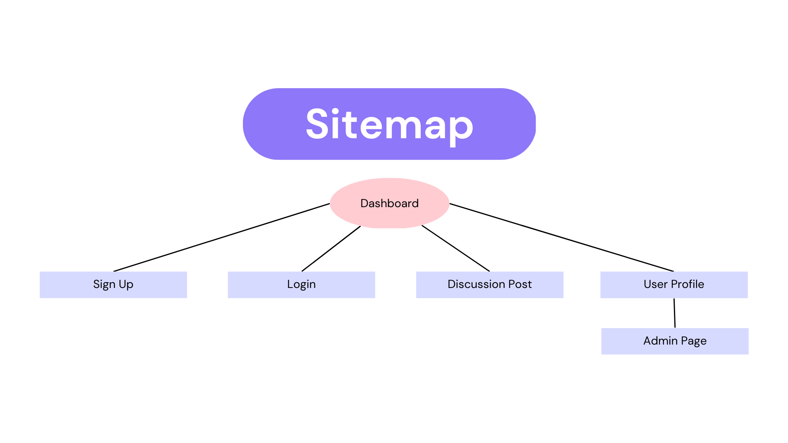

# Client-Side Experience
## Design
Read-IT is a reddit clone and we wanted it to be similary to the original design because we think it is easy for users to understand what is happining. We have the header at the top which displays the title of the account. We also have the user profil in the top left hadn corner so the user can access their profile. We have all seen that layout on many other websites like facebook and even github. our body of the page includes a two div layout. on the right side is a task abr. Where users will be able to see their profile or create a post. the middle/left is where all the information of the page will be. Reddit also does a similar layout and we wanted to make it easy yo understand just like how they did. The color comes from colorhunt and we thought it was a friendly layout. 

## Logical process 
As states before we wanted a layout similar to something users have seen before so it would be easy to undertsand. We want the users of the page to be able to easily view comment and ready posts from random users. 
These processes incude: 
1. login: User will sign into their accounts to be able to post and add comments to posts 
2. signup: if a user isnt signed up they will easily be able to do that  
3. Go to profile page: To go to profile page the user will click at the top right side of the nav bar where their profile image is. 
4. View their own posts/threads: A user im their home page will be able to customize their profile picture add a comment about themelves and view old posts of theirs 
5. view others posts/threads: to view other peoples posts they would got to the home page to see all the posts. they then will be able to interact with the posts that catch their interest
6. Ban Users (ADMIN): if someone is an admin they will be able to ban users from the READ-IT website bye entering their profile name and the reason they got banned.Admin's have special authority on the website.   

## Layout

Dashboard

The dashboard page is the main page of the site, where users can view discussion posts and navigate to all other pages. we wanted to make it easy for users to view and other posts. on the right side in case users wanted to go back on their old post visited we added it to the users board. As well as an easy way for users to upload their own threads

Sign Up

The sign up page is used to create an account for the site, allowing users to access more features. it is a simple and easy to unserstand design. We arnt sure yet if we wanna make the user to upload an email or if it will just be a username. With a username we dont need to make sure that it is an email. However emails have more of a validation for users. We are leaning towards using an email for users to login. To do that users would then have to make up their own username for for their Profil and we will have to include that for the signup page, as it is missing at the moment. 

Login

The login page allows users to provide their credentials to login to the site. the login page is just like the Signup page. Easy to use and understand as we have all seen similar pages when we login to our favourit websites. there is also a link for users to signup. if we cannot find the users login name we would suggest to the user if they have an account.  

Discussion Post

The discussion post page includes the post's content, information about the poster, and a comment section. Our look for this post is to be similar to reddits. You see the post and it is easy to read/ view. You will also get the ability to comment on comments or even comment on the post. Reddit has a great design for this and we didnt want to reinvent the wheel. We also will suport uploads of images. 

User Profile

The user profile page shows the posts created by the user, as well as the user's information. The user profile will easily be able to view all of their post, that they have. this is on the left hand of the screen. We added a recent, Older and search option for the user to view all their own posts. This gives the user flexabilty when dealing with their posts. We also wanna give the user a chance to delete their own post. On the right hand side we give the user a chance to update their profile. They can add a comment about themselves, add a profil pic and easily post a thread as well. A profil page deserves to be customizable and thats what we added to the user profile page

Admin

The admin page view is used to delete posts and ban users, and can only be accessed by admin users. We also wanted to stats each admin would have on their own, which would be the ability to see how many people they have banned. Besides that the admin page is easy to understand and use. We did not want to overcomplicate it. Each admin page will be assesable through their own user profile page. 

## Site Map

Users can access the login, sign up, discussion post, and user profile pages from the dashboard page. Additionally, the admin page can be accessed from the user profile page if the user has admin permissions.

## Logic Process

## Example Pages
